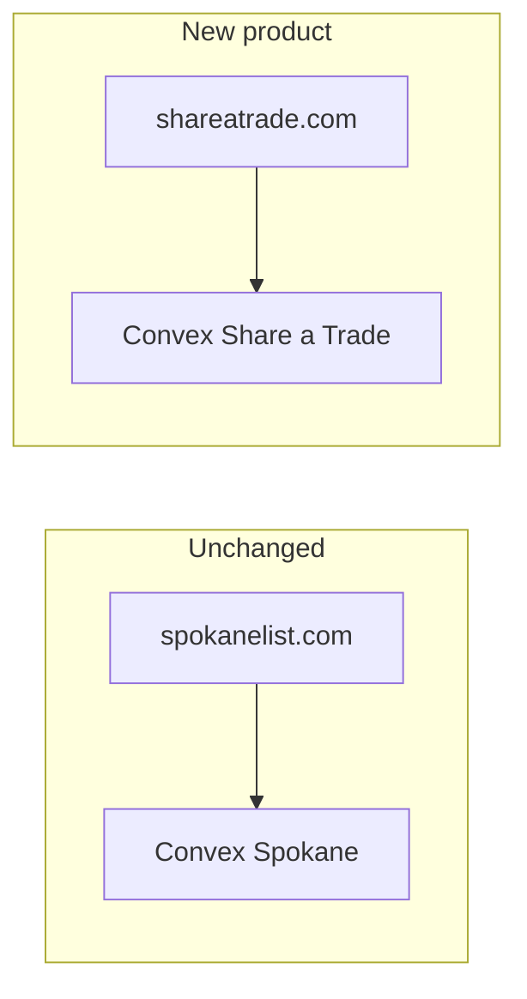

# Share a Trade: clone, don’t share Convex

**Keep this repo and Convex deployment as Spokane List only.** Pointing shareatrade.com at the current database would mix products, leak every listing into both sites, collide slugs (`joe-plumbing` in two metros), and run Spokane-only jobs (WA L&I cron, DataForSEO location `Spokane,Washington`) against national data.

Clone the codebase into a **new git repo**, create a **new Convex project**, and wire a new `PUBLIC_CONVEX_URL`. Duplicate Spokane listings into the new DB if you want `/spokane` on day one. That is a copy, not a live share—Spokane List stays independent.

## Why a new Convex project

Today `[convex/contractors.ts](convex/contractors.ts)` `list` / `listNav` collect **the entire table**. `[getBySlug](convex/contractors.ts)` looks up **global** `by_slug`, not city-scoped. Identity for upserts is `googleCid` or `slug` across the whole deployment.

Sharing one backend would mean:

- National `list()` dumps every city into Spokane List’s homepage
- Cross-metro slug and CID merges on import
- One `listingRequests` inbox
- License/GBP jobs that are hardcoded to WA / Spokane (`[convex/licenses.ts](convex/licenses.ts)`, `[convex/gbpRefresh.ts](convex/gbpRefresh.ts)`)

A new project is the same Convex _code pattern_, isolated data, isolated env (DataForSEO location, keys), and no risk of `npx convex deploy` or `clearAll` hitting the live Spokane directory.

## URL shape (recommended)

Treat the first path segment as a **market** (metro), not a raw city string. That matches how this site already groups Spokane Valley, Liberty Lake, Cheney, etc. under one community.

| URL                                        | Role                                                         |
| ------------------------------------------ | ------------------------------------------------------------ |
| `shareatrade.com`                          | National home: pick a market                                 |
| `shareatrade.com/spokane`                  | Directory for that market (Valley, Liberty Lake, … included) |
| `shareatrade.com/raleigh`                  | Same for Raleigh                                             |
| `shareatrade.com/spokane/acme-plumbing`    | Listing (slug unique **per market**)                         |
| `shareatrade.com/go/spokane/acme-plumbing` | Unlisted microsite, still noindex                            |

Do **not** keep `/{slug}` at the root. Reserved pages (`get-listed`, `terms`, …) stay at the root. City slugs must not collide with those names.

Listing helpers today in `[src/lib/site.ts](src/lib/site.ts)` (`listingPath` → `/${slug}`) become `/${market}/${slug}`.

## Data model changes (new repo only)

Add a `markets` table (or a small config file for the first few cities, then a table):

- `slug` (`spokane`, `raleigh`)
- `name`, `state`
- `cityAliases` or a `marketId` on each contractor (Spokane Valley → market `spokane`)

On `contractors`:

- `marketSlug` (or `marketId`)
- Indexes: `by_market`, `by_market_and_slug`, `by_market_and_category`
- `getBySlug` → `getByMarketAndSlug`
- `list` → `listByMarket` with pagination (national volume will break `.collect()` and full SSG)

License enrichment stays **off or WA-only for the Spokane market** until you add other state datasets. GBP refresh should take the market’s DataForSEO location, not a single env default.

## How to start the new repo

1. Clone this repo into a new GitHub repo (new remote). Do not push Share a Trade commits here.
2. `npx convex dev` in that repo so Convex creates a **new** deployment. New `.env.local` with that URL.
3. Rebrand once: `[src/lib/site.ts](src/lib/site.ts)` → `Share a Trade`, `hello@shareatrade.com`, `CONTACT_NAME` stays Mauricio Valencia; swap logos/favicons/trade CDN to the new assets; replace hardcoded `spokanelist.com` in copy/share examples.
4. Introduce market routing and filtered queries **before** importing a second city.
5. Import Spokane as market `spokane` (copy/export from this project or re-run LocalProspects with a Spokane location). Then add Raleigh the same way.

## Scale (don’t copy today’s SSG blindly)

This app is fully static: `getStaticPaths` over every contractor (`[src/pages/[slug].astro](src/pages/[slug].astro)`). That is fine for one metro. National catalogs want:

- Convex queries **always** scoped by `marketSlug` + pagination
- City hub pages prerendered; listing pages on-demand or prerender **per market** as you launch them
- Plan a Cloudflare/Astro adapter when the listing count no longer fits a full static build

## What stays Spokane-specific (port later, don’t block launch)

- WA L&I license matching
- Greater-Spokane city fingerprints in `[scripts/import-lib.mjs](scripts/import-lib.mjs)`
- Copy that says “Inland Northwest”
- Trade photos: point `[src/lib/tradePacks.ts](src/lib/tradePacks.ts)` at the new CDN folder

## Launch sequence

1. New repo + new Convex + rebrand + `/[market]` directory.
2. Ship **Spokane only** on shareatrade.com so the product matches this one, with nested URLs.
3. Add markets as config/rows + imports; homepage becomes a city index.
4. Spokane List remains `spokanelist.com` on the current Convex project, unchanged.
